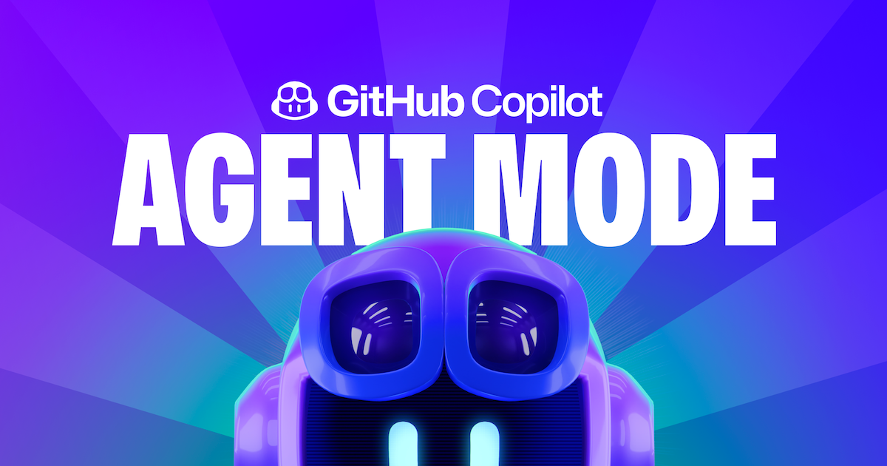

## GitHub Copilot Workshop for Beijing AI Tour



GitHub Copilot 是辅助代码开发的工具，可通过 GitHub Copilot 完成代码生成，上下文补全，优化工作，更在新一代的 GitHub Copilot Chat 中更有 Agent 模式让你可以通过需求直接创建项目。本次 Workshop 我们会让每一位参与者能通过零代码的方式创建 Copilot 应用。让您体会在 AI 的加持下，人人都是项目经理。

### 🔨 准备工作

1. 请登录您的 GitHub 账号(如果您还没有 GitHub 账号，点击该地址开通 [https://github.com/signup](https://github.com/signup)), 然后 fork 该项目给 ✨ 后, Clone 该项目 


```bash
git clone https://github.com/kinfey/GitHubCopilotAgentWorkshop
```

2. 请确保本地环境安装以下内容

- Python 3.10.8+ (建议使用 Miniforge 安装)
- Visual Studio Code Insider [https://code.visualstudio.com/insiders/](https://code.visualstudio.com/insiders/)
- Python Visual Studio Code 插件

1. 本次 workshop 基于免费版本的 GitHub Copilot，具体内容您可以访问 [https://github.com/github-copilot/signup](https://github.com/github-copilot/signup)

### 🧪 实验步骤

| 步骤 | 内容 | 操作 |
| -------- | ------- | ------- |
| 01 | 认识 GitHub Copilot 模型的各种能力  | [进入](./md/01.GitHubCopilotModels.md)  |
| 02 | 了解 GitHub Copilot Edit 模式下使用 Agent 模式    | [进入](./md/02.IntroduceGitHubCopilotAgentMode.md)  |
| 03 | 在 Ageent 模式下创建 Copilot 应用前端   | [进入](./md/03.CreateCopilotUI.md)  |
| 04 | 通过 GitHub Copilot Agent 调用 GitHub Models  | [进入](./md/04.CreateCopilotBackend.md)  |

### 更多资源


1. 免费使用 GitHub Copilot  https://aka.ms/CopilotFree_R

2. 了解 GitHub Models https://gh.io/models

3. 阅读博客 GitHub Copilot: The agent awakens https://github.blog/news-insights/product-news/github-copilot-the-agent-awakens/
 