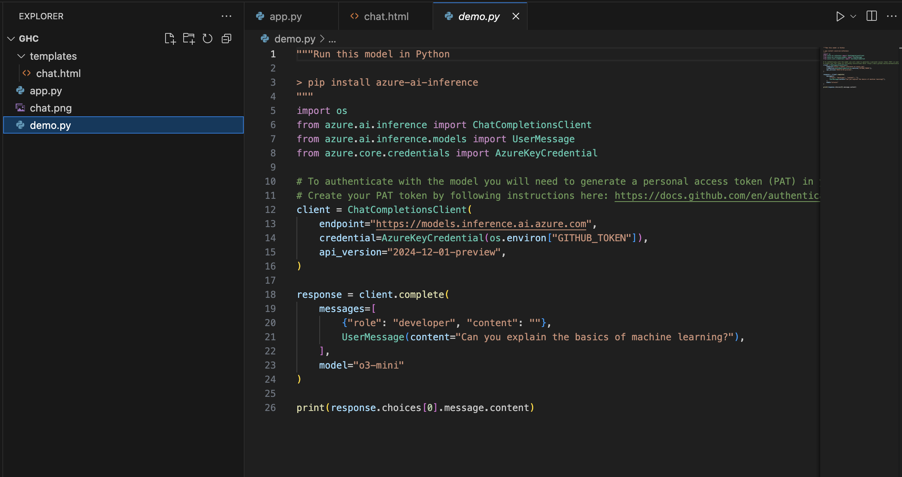
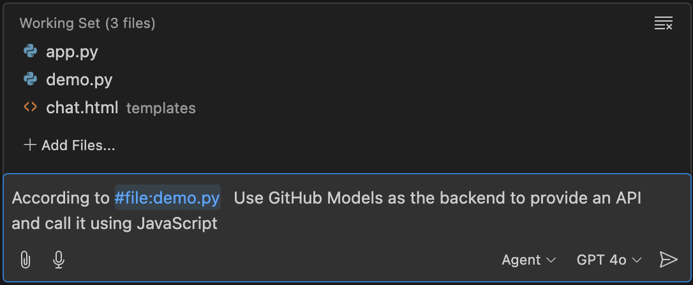
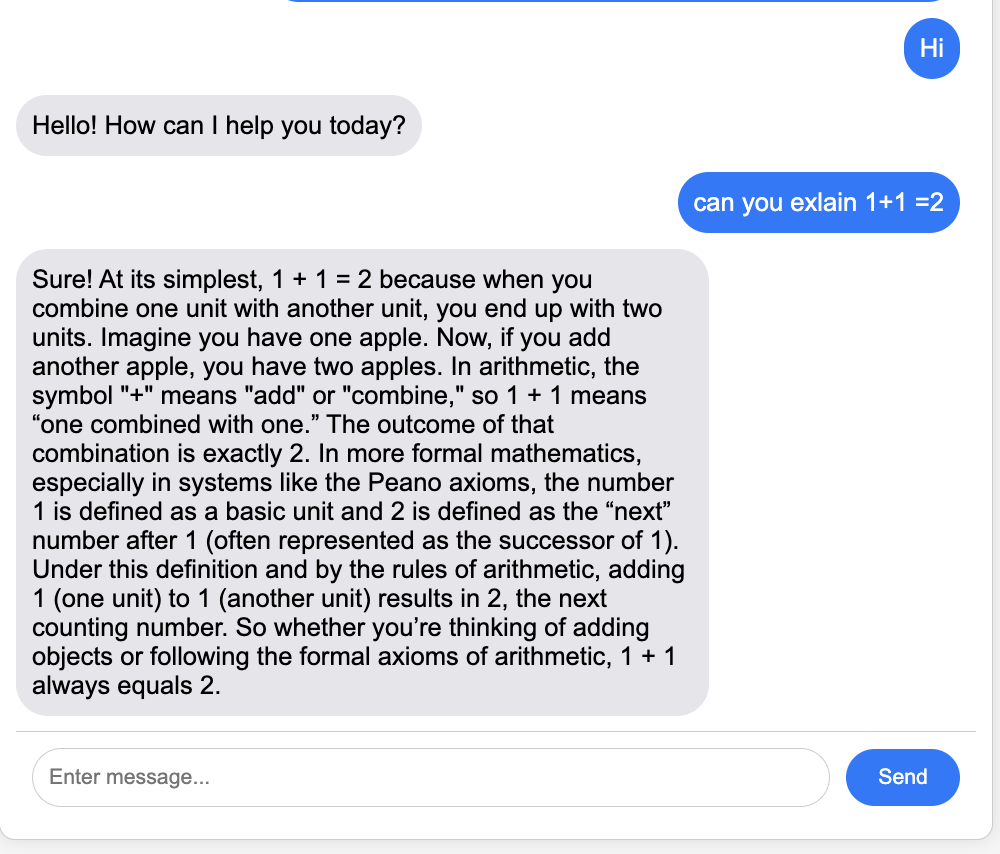

## **四. 通过 GitHub Copilot Agent 调用 GitHub Models**

完成前端设定后，我们希望结合 GitHub Models 中的 o3-mini 来作为后端，但 GitHub Copilot 不能正确使用 Azure AI Inference SDK 调用 GitHub Models，通过 Agent Mode 的方式可以引用关联文档，问新的需求和提供参考代码. 我把 GitHub Models 的 Python 参考代码放进项目文件夹内

通过 Agent Mode 引用，使用以下 Prompt 进行增加

***"According to #file:demo.py Use GitHub Models as the backend to provide an API and call it using JavaScript"***

这个时候 Agent Mode，就帮你在对应的代码中添加对应的 GitHub Models 调用代码了,您只需要接受即可。

注意 ：如果您希望获取 GITHUB_TOKEN，请通过 Get API Key 获取，

我们尝试运行一下，一个 Copilot Chat 的应用就完成了

GitHub Copilot Agent Mode 让 GitHub Copilot 的使用者更快捷便利地完成应用，并且让非计算机的需求者更高效地完成原型或者应用构建。“人人能编程”的梦想不远矣。