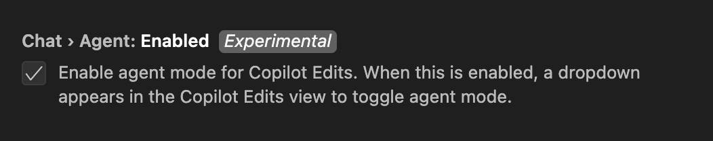
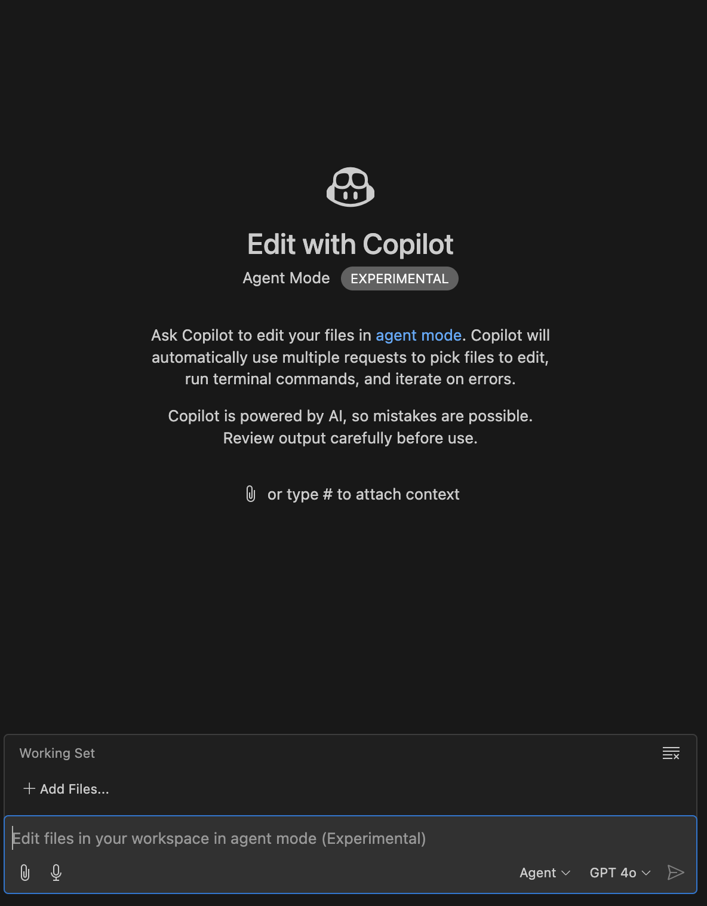

## **二. 认识 GitHub Copilot Agent 模式**

使用 GitHub Copilot 有两类人，工程人员和非工程人员。在早期的 GitHub Copilot 中，更关注是工程人员的赋能，如代码生成和优化，测试单元，以及部署等。对于非工程人员的赋能，全新的 Agent 模式就是一个答案。

**注意：** 开通 GitHub Copilot Agent Mode， 需要通过 Visual Studio Code Insiders 设置开通 **GitHub Copilot Agent Mode**

GitHub Copilot Agent 可以让非工程人员提交一个简单的需求，一步步创建项目，从分析代码，读取创建文件，并可以结合终端完成运行测试等工作。我们可以通过通过 GitHub Copilot Agent 快速创建一个 RAG 应用，具体步骤：

选择 Agent Mode 和对应的模型。现在 GitHub Copilot Agent Mode 支持 GPT-4o, Claude 3.5 Sonnic，以及 Gemini.我建议还是考虑 GPT-4o ， 因为支持图片上传。

### **Agent 模式已在预览版中推出 🤖**

GitHub Copilot 的Agent 模式能够迭代自己的代码、识别错误并自动修复错误。它可以建议终端命令并要求您执行它们。它还使用自我修复功能分析运行时错误。

在代理模式下，Copilot 不仅会迭代自己的输出，还会迭代该输出的结果。它会一直迭代，直到完成完成提示所需的所有子任务。Copilot 现在不仅可以执行您请求的任务，还可以推断未指定但对主要请求工作也必不可少的其他任务。更棒的是，它可以捕获自己的错误，让您无需从终端复制/粘贴回聊天。

我们的步骤3，4，5 都会围绕 GitHub Copilot Agent 模式完成

