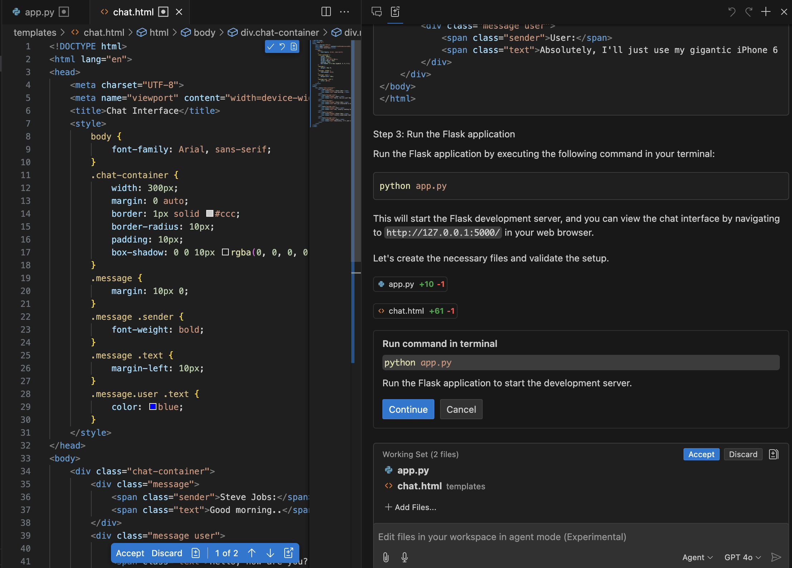

## **三. 在 Agent 模式下创建 Copilot 应用前端**

我们希望有一个  Facebook Messenger 风格的 Copilot Chat，所以我们去找到一张 Facebook Messenger 的截图作为需求。如图

我们在 GitHub Copilot Mode + GPT-4o 的场景下，把该图片作为附件添加进 GitHub Copilot 聊天窗

输入以下  ***Prompt***

***"Generate a Python Flask application based on the content of the image"***

我们可以看到在 GitHub Copilot Agent Mode 上协助我们生成了以 Python + Flask 的应用，你可以检查生成文件进行接受

然后按照提示运行，您会发现缺少元素,样式和布局出错等

您可以通过 Prompt 进行调整，如

- ***“Adjust page content based on image content, style, and layout”***
- ***“The chat window height and width are adaptive to the browser size, and the user picture is removed”***

通过聊天您可以成功获取满意的界面，接下来希望 AI 能根据现有代码进行调整。这是最基础的前端，当然，您可以根据自己需要进行综合调整。

